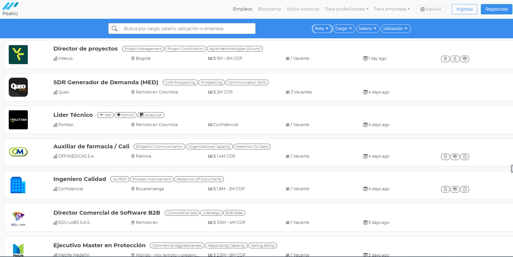

# Proyecto Vue.js 
## Workshop03-vue - Replica de Interfaz de Usuario de peakU/es/empleos

Este proyecto tiene como objetivo replicar la interfaz de usuario del sitio web [peakU/es/empleos](https://peaku.co/es/empleos) utilizando Vue.js versión 2.




## Instalación

Asegúrate de tener [Node.js](https://nodejs.org/) instalado en tu sistema antes de continuar.


## Project setup
```
npm install
```

### Install VueJS
```
npm i -g @vue/cli
```

### Install Bootstrap para VueJS
```
yarn add bootstrap bootstrap-vue
```


### Compiles and hot-reloads for development
```
npm run serve
```

### Compiles and minifies for production
```
npm run build
```

### Lints and fixes files
```
npm run lint
```

### Customize configuration
See [Configuration Reference](https://cli.vuejs.org/config/).

## Integrantes
- Santiago F. Estrada
- Santiago Paredes